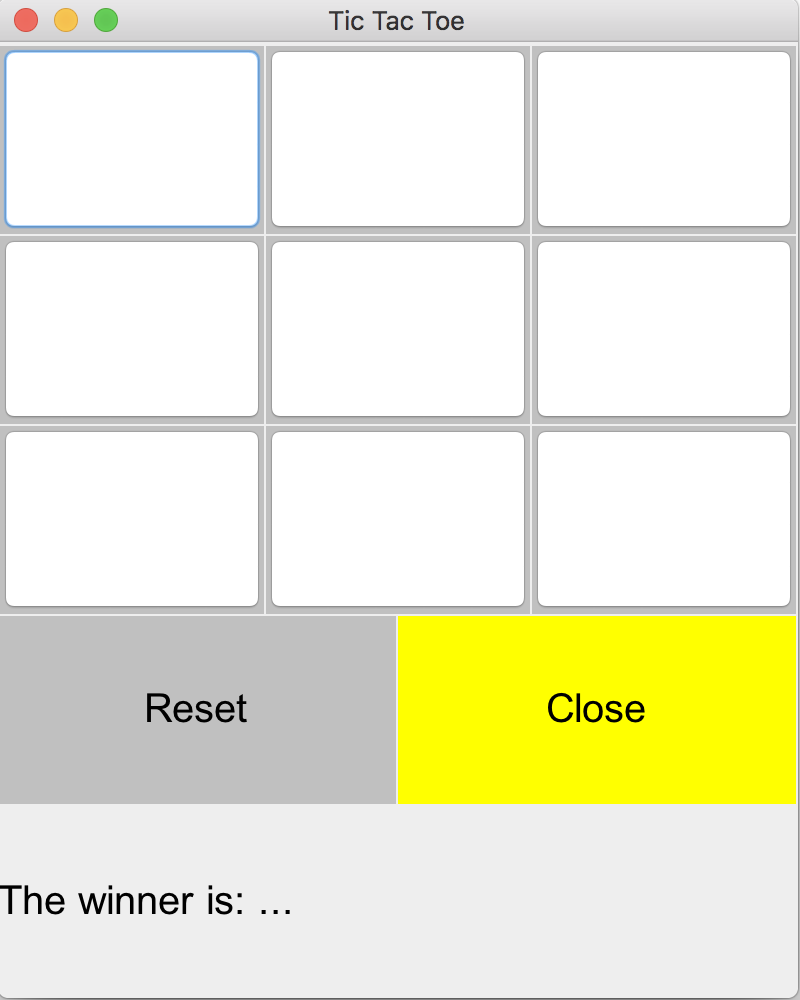
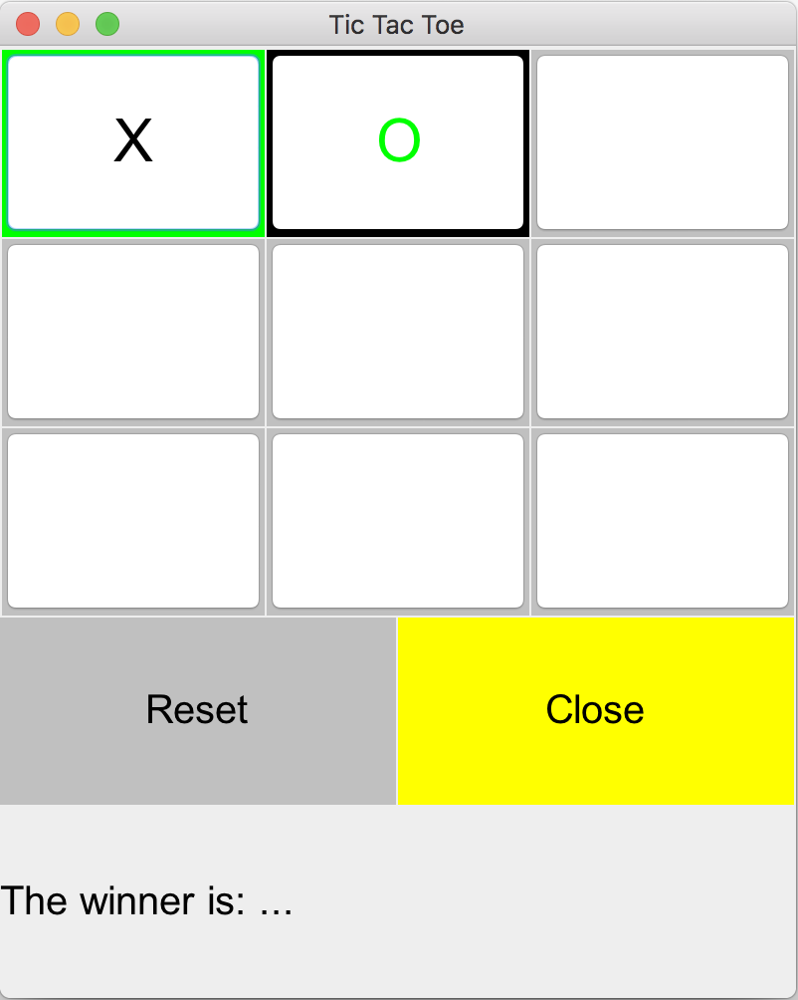
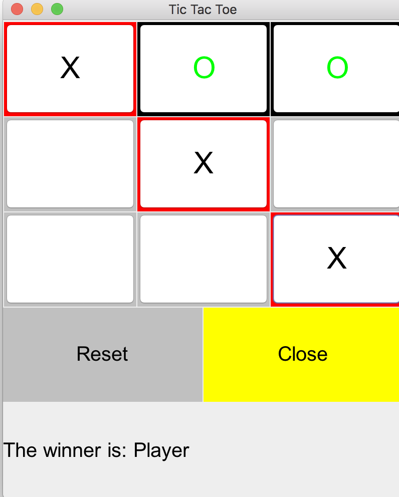
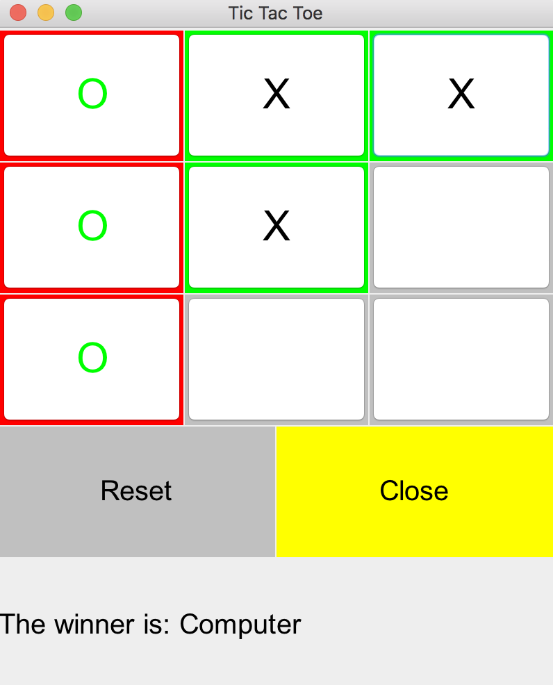
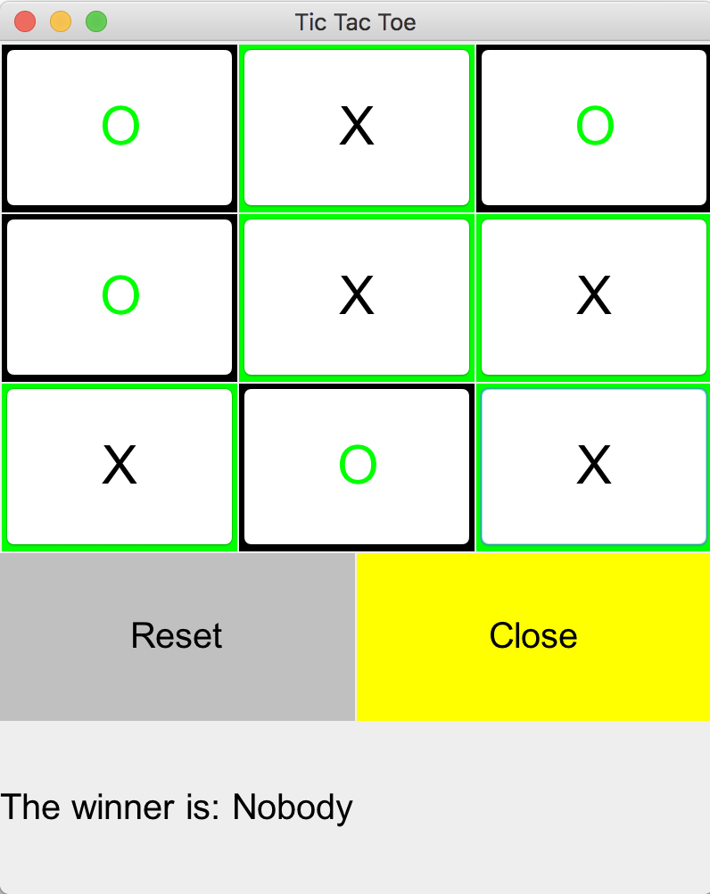

# Tic-Tac-Toe
A short game of tic tac toe written in Java.

As the game starts, the user sees the following screen:
* an empty 3x3 grid
* 'reset' button
* 'close' button

The user has the first move. The clicked cell's border is colored in green, and computer's choice is colored in black:

The game can end either when the user wins, the computer wins or neigher. A desciption of the winner is noted at the buttom of the screen as can be seen in the following images:

An executable file can be found in the release tab of this repository
